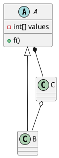
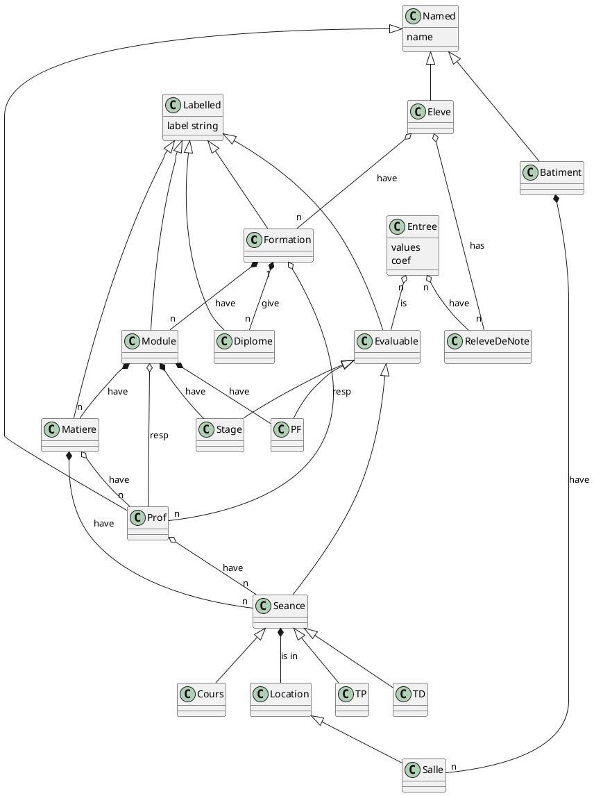

# Introduction à la conception et la programmation orientée Objet


Luc Hogie
*luc.hogie@cnrs.fr*


La programmation de logiciels est souvent considérée comme un Art. Sa bonne pratique nécessite la maîtrise d'un ensemble conséquent de techniques.
Un programmeur débutant aura le réflexe de pratiquer la programation procédurale qui tend à organiser les données dans des tables associatives globales (un peu analogue à ce qu'on trouve dans une base de données relationnelle), sans en proposer une structuration. Le code, lui sera organisé en procédures/fonction globalse. Un programme Java procédural ressemblera à ça : 
```java=
String p = "Luc";
System.out.println(p);
p2age = new HashMap();
p2age.put(p, 45);
System.out.println(p2age.get("Luc"));
String p2 = "Isabelle";
p2age.put(p2, 42);
System.out.println(p2age.get("Isabelle"));
p2birthdate = new HashMap();
p2birthdate.put(p, "28/12/2021");
```
Intuitive, la programmation procédurale  est inapplicable dans un contexte de programmation professionnelle car le code qu'elle résulte est difficile à comprendre, ce qui le rend difficile à écrire/corriger/étendre. Il n'est pas raisonnable de reposer le dévelopement d'un grand logiciel sur un modèle de conception/programmation procédurale.

La conception/programmation orientée objet (POO) a pour vocation de pallier à tout cela : elle propose une structuration des données et des codes qui visent à les rendre le logiciel produit de plus grande qualité.


# Les languages

La plupart des langages de programmation permettent de programmer en orienté objet, même si n'avait pas été prévus pour cela à l'origine, comme c'est le cas des dinausores COBOL et Fortran ou de Python.

S'ils permettent de le faire, ils le font très différemment. Très brièvement :

Java est le langage objet le plus utilisé aujourd'hui. Il offre un environnement de programmation professionel d'excellente qualité et offre une vitesse d'exécution proche de C++. Il pêche par sa gestion automatique de la mémoire qui le rend inutilisable quand l'application doit gérer un très grand nombre d'objets.

C++ est le plus rapide mais aussi le plus difficile des languages de POO. Il est a privilégier quand les performances sont critiques.


La POO repose sur un ensemble de concepts que ne allons détailler ici.

# La classe
Le concept de *classe* est central en POO.

Une classe est description d'un concept du système.

Une classe a un nom qui doit exprimer son rôle de la manière la plus juste possible.

Une classe est composée de *membres*:
- ses *attributs* (ou *données membres*, ou *champs*)  définissent ce qu'elle sait
- ses *méthodes* définissent ce qu'elle est capable de faire.

Les attributs d'une classe peuvent être de n'importe quel type. Il peut s'agit de types primitifs (int, double, float, etc) et de références vers d'autres objets. Ce dernier cas permet de construire un système à objets.

Voici un petit exemple de code Java qui décrit une classe.

```java=
class A {
    int aField;
    double anotherField;
    String aReferenceToAString;
    A aReferenceToAnotherA;
    
    void aMethod(String aParameter);
}
```

```java=
class B extends A {
}
```


La signature d'une méthode est composée de :
- sa visibilité (public, private, protected)
- son type de retour
- son nom
- sa liste de paramètres


# Abstraction
Une méthode dont une classe ne propose que la signature est une méthode abstraite. Une classe qui a au moins une méthode abstraite est elle-même abstraite. Par conséquence elle ne pourra être instanciée.

Une classe ne propose pas toujours d'implementation des méthodes qu'elle expose. Une méthode ne peut n'être que déclarée et ne pas proposer de code qui l'implémente. Ceca signifie que l'implémentation devra être définie par les sous-classes. Une classe qui ne propose pas d'implémentation de toutes ses méthodes (donc qui a au moins une méthode non implémentée) est appelée *classe abstraite*. Si une classe propose au contraitre un implémentation pour chacune de ses méthodes, elle dira que c'est une *classe concrête*, et elle pourra être instanciée. Dans la pratique, un logiciel propose des implémentation pour toutes ses classes abstraites. L'abstraction n'a pour vocation que de clarifier et d'organiser le code du logiciel.


Le conception d'*interface* défini une classe qui n'a que des méthodes abstraites et aucun attribut. En C++, on parlera plutot de *classe abstraite pure*.


## Encapsulation
L'encapsulation est un mécanisme géré par le compilateur qui permet de définir la *visibilité* des membres d'une classe. Elle s'applique aux attibutes (aux données) autant qu'aux méthode.
Notons 3 visibilités possibles :
- public : un membre public est accessible depuis tous les autres objets du système
- protected : un membre protected n'est accessible que depuis les sous-classes
- private : un membre private n'est aucunement accessible depuis l'extérieur de la classe, par quelque objet que ce soit.

L'encapsluation permet de réduire au strict minimum la visibilité/l'accessibilité des membres des classes, réduisant d'autant le risque d'un programeur malveillant ou incompétent ne viene introduite des bugs dans le code : n'est visible par le programmeur que l'interface métier de l'objet.

```java=
class TheNameOfTheClass {
    private int aField; // fields generally are private
    public void aPublicMethod(); // serves the public API of the class
    private void f(); // utility method used within the class itself
}
```

## Instanciation

Une classe définit un type et va permettre l'instantiation (la création) d'objets de ce type. En Java, la création d'une instance d'une classe donnée se fait via l'opérateur *new*.
```java=
Car c = new Car();
```
Notons que depuis Java 11, le langage offre l'inférence de type et permet l'écriture suivante :
```java=
var song = new Song();
```
La variable *c* est une référence vers un objet de type *Car* qui a été alloué dans le *tas*.

## ou sera l'objet en mémoire ? Dans la *pile* ou dans le *tas ?
La pile et le tas sont les deux mémoires logiques à la disposition d'un programme pour y gérer ses données.

### la pile
La pile est une zone de stockage locale au thread courant. Chaque thread a sa propre pile. Au démarage d'un thread, sa pile est vide. Chaque nouvelle déclaration de variable dans le programme entraine la réservation de mémoire au sommet de la pile (*push*). Au delà de la portée d'une variable, celle-ci est retirée (*pop*) de la pile.

La portée d'une variable est limitée au bloc dans lequelle elle a été déclarée : en sortie de bloc, toutes les variables qui avaient été déclarées dans celui-ci sont dépilées.


```java=
int a, b; // place 2 entiers dans la pile;
Song song; // place une référence vers un objet dans la pile
```

Attention, le code C++ suivant ajoute un objet *Song* sur la pile, et pas juste une référence.
```cpp=
Song song;
```
En effet, cette différence entre Java et C++ est notable : quand Java ne permet à l'utilisateur de n'avoir à sa disposition que des références à des objects, C++ offre la possibilité d'avoir l'objet lui-même. 
L'équivalent C++ du code Java qui ajoute une référence (mais pas l'objet) serait celui qui ajoute un *pointeur* à la pile :
```cpp=
Song* song;
```
Ceci illustre le fait qu'il n'est pas possible en Java de stocker un objet dans la pile : on peut simplement stocker une référence vers un objet.

### le tas
Le tas est une zone de stockage global à tout le processus. Une allocation dans le tas se fait via l'opérateur *new* (en Java comme en C++). Le code Java suivant alloue un nouvel objet de type *Song* (et non sa référence) dans le tas et alloue au sommet de la pile une référence vers ce nouvel objet.
```java=
Song song = new Song();
```

Le code équivalent en C++, lui, retourne un *pointeur* vers l'objet nouvellement créé.
```cpp=
Song* song = new Song();
```
La position physique dans le tas n'est controlable par le programmeur : elle est décidée par l'OS qui va chercher à optimiser l'utilisation du tas.


## L'héritage
On l'appelle la relation *is a*.
Elle exprime le fait qu'une classe étend une autre en héritant de tous ses champs *public* et *protected*.

Une classe fille (ou sous-classe) qui hérite d'une autre classe (classe mère, super-classe) se voit donc dotée des mêmes attributs et méthodes.

Une méthode abstraite devra être implémentée dans les sous-classes concrètes. Une méthode implémentée dans une classe pourra être ré-implémentée plus bas dans l'arbre l'héritage. On parlera alors de ***redéfinition***. En Java, cette redéfinition pourra, si elle le souhaite appeler l'implémentation initiale à l'aide du mot clé ***super***.
```java=
public void aMethod() {
    // call super implementation
    super.aMethod();
    // any other code here
}
```
La rédéfinition de méthode ne doit pas être confondue avec la ***surcharge*** qui, elle, consiste à proposer une méthode de même mais avec des paramêtres différents.
En Java, si toutes les methodes sont abstraites et que la classe n'a aucun attribut, alors on peu parler ***d'interface***. 


### Polymorphisme
Le polymorphisme est le mécanisme qui permet de faire en sorte que le code exécuté lors de l'appel d'une méthode soit le code défini dans l'implémentation du type *concret* de l'objet.
Le polymorphisme permet de s'affranchir de la connaissance du type concret tout en permettant l'appel des codes déclarés dans sa hierarchie de classe.


### exemple : les collections
L'exemple suivant introduit une hiérarchie de classes analogue à l'API des collections en Java. Nous définissons qu'une collection est simplement un conteneur d'objets. Il n'est qu'une abstraction car il ne propose aucune implémentation. Cette abstraction peut etre spécialisée en deux types de conteneurs que vous connaissez déjà :
- ***l'ensemble (set)***, est un conteneur qui ne peut contenir qu'une seule fois un élément donné (pas de duplica)
- ***la liste*** est un conteneur qui définit que chaque élément contenu est associé à un index particulier.
  
La classe liste doit donc introduire un ensemble de nouvelles méthodes pour la gestion des index. 
De son coté ,la classe *Set* n'a pas besoin de nouvelle méthode pour introduire sa contrainte d'unicité de ses élements, mais simplement d'une impémentation particulière de sa méthode *add()*.(au niveau de Hashset)

```java=
abstract class Collection {
        public abstract void add(Object e);
        public abstract void remove(Object e);
        public abstract void contains(Object e);
        public abstract int size();
    }

abstract class Set extends Collection {
        @Override
        public void add(Object e) {
            if (contains(e))
                throw new Error("already in");
}

class HashSet extends Set {
        @Override
        public void add(Object e) {
            super.add(e);
        }
}
```


# UML
Dans la phase de modélisation d'un logiciel, on ne parle le moins possible  de Java et d'implémentation en général. Afin de permettre la commmunication entre l'expert métier (expert fonctionnel) et le concepteur du logiciel, on utilise un langage graphique compréhensible de tous. Le langage *de facto* depuis une 20aine d'années est UML (Unified Modeling Language). UML propose un ensemble de diagrames différents qui permettent l'expression des fonctionalités, comportements et architecture d'un logiciel. Dans la pratique, le diagrame de classes est de loin le plus utilisé. 
Il montre les classes du modèle du logiciel et leurs interactions. 

Les classes sont représentées par des rectangles qui sont les noeuds d'un graphe, et leur relations le sont via des connections entre ces noeuds.

Il existe 2 types de relations :
- l'association
- l'héritage


## L'association
L'association en UML est dotée d'une multiplicité (cardinalité) qui définit le nombre ou l'intervale d'élements que l'association concerne.

UML définit 2 types d'association :
### la composition
La composition se note via un losange plein, exprime le fait que la destruction de objet contenant entraine la destruction des objets contenus. 
La composition n'est pas supportée nativement par le langage Java.

### la aggrégation
Elle se note via un losange vide, est plus souple dans le sens ou les objets contenus peuvent continuer d'exister indépendamment de leur contenant (ils peuvent être autonomes, ou ratachés à un autre contenant). Si le contenant vient à être supprimé du système, les objets qu'il contenait ne sont pas détruits et et continuerons à être référencés par d'autres objets.


### produire un diagramme UML
Il existe de nombreux outils pour produire des diagrammes UML. Dans le monde Open Source, l'éditeur graphique Dia est fréquemment cité.

L'approche DSL (Domain Specific Language) est cependant beaucoup plus souple. PlantUML est un langage Open Source qui s'attaque justement à la production automatique de diagrammes UML. 
Voici un petit exemple de code PlantUML :

Et voici ce que l'outil génère comme diagramme :


Ce tout petit exemple contient tout ce qu'il faut pour élaborer un diagramme de classe !


Editeur UML en ligne :
- https://plantuml-editor.kkeisuke.com/
- http://www.plantuml.com/plantuml/uml/


# A lire aussi


Une discussion sympa sur un forum :
https://qastack.fr/software/120019/whats-the-benefit-of-object-oriented-programming-over-procedural-programming

https://en.wikipedia.org/wiki/Composition_over_inheritance


# Diagrame UML : FAC



# A voir aussi
design patterns
conversion en base de données
throws
C++ static method call
generics


# tips
alaways choose the right name
think about large scale (complexity, recursivity)

# Integration : ArrayList, ArraySet

```java=
public interface Collection{
     
    public void add(Object e);
    public boolean remove(Object e);
    public int size();
    public boolean contains(Object e);
}
public interface List extends Collection{
    
    public void add(Object e, int i);
    public boolean remove(int i);
    public Object get(int i);
}
public interface Set extends Collection{
}
import java.util.Arrays;

public class ArraySet implements Set{

    private Object[] elements = new Object[0];

    @Override
    public void add(Object e) {
            elements = Arrays.copyOf(elements, elements.length+1);
            elements[elements.length-1] = e;
            
        
    }

    @Override
    public boolean remove(Object e) {
        if(this.contains(e)){
        Boolean indice = false;
            Object[] tmp = new Object[elements.length-1];
            for(int i = 0, j = 0; i < elements.length;i++){
                if(elements[i] != e || indice){
                    tmp[j] = elements[i];
                    j++;
                }
                else
                    indice = true;
            }
            elements = tmp;
            return true;
        }
          
        return false;
        
    }

    @Override
    public int size() {
        return elements.length;
    }

    @Override
    public boolean contains(Object e) {
        for(int i=0;i < this.elements.length;i++){
            if(elements[i].equals(e))
                return true;
        }
        return false;
    }
    
    @Override
    public String toString() {
    String s = "";
    for(int i = 0; i < elements.length;i++){
        s+=elements[i] + "\n";
    }
        return s;
    }

}
import java.util.Arrays;

public class ArrayList implements List{

private Object[] elements = new Object[0];

@Override
public void add(Object e) {
    elements = Arrays.copyOf(elements, elements.length+1);
    elements[elements.length-1] = e;
    
}

@Override
public boolean remove(Object e) {
    if(this.contains(e)){
    Boolean indice = false;
        Object[] tmp = new Object[elements.length-1];
        for(int i = 0, j = 0; i < elements.length;i++){
            if(elements[i] != e || indice){
                tmp[j] = elements[i];
                j++;
            }
            else
                indice = false;
        }
        elements = tmp;
        return true;
    }
      
    return false;
}

@Override
public int size() {
    return elements.length;
}

@Override
public boolean contains(Object e) {
    for(int i=0;i < this.elements.length;i++){
        if(elements[i].equals(e))
            return true;
    }
    return false;
}

@Override
public void add(Object e, int i) {
    Object[] tmp = this.elements;
    int newLengthr = tmp.length + 1;
    Object[] newArray = new Object[newLength];

    for(int j = 0,v =0; j < tmp.length; j++){
        if(j == i){
            newArray[j] = e;
            v=1;
        }
        else{

        newArray[j] = tmp[j-v];
        }
    }    
}

@Override
public boolean remove(int i) {
    if(elements.length > i  && i > 0){
        Object[] tmp = elements;
        elements = new Object[tmp.length-1];
        for(int j = 0,v = 0; j < tmp.length;j++){
            if( j != i){
                elements[v] = tmp[j];
                v++;
            }
    }
    return true;
}  
    return false;
}

@Override
public Object get(int i) {
    return elements[i];
}

@Override
public String toString() {
   String s = "";
   for(int i = 0; i < elements.length;i++){
       s+= i + " = " + elements[i] + "\n";
   }
    return s;
}
}

```

## Comparaison

L'opérateur `==` permet la comparaison des valeurs numériques de deux variables. Ces variables peuvent de type primitif (int, double, etc) ou des références.
Dans ce dernier cas, il sera effectué un ***test d'identité*** des deux objets référencés : s'agit-il du même objet ? En aucun cas le contenu des objets est regardé : `==` ne s'intéresse qu'a la valeur numérique des références (leur adresse).

Afin de comparer le contenu de deux objets, on utilise la méthode `Object.equals(Object)`. La responsabilité de l'implémentation de celle-ci est la charge du programmeur de la classe.


* `==`  compare les références de deux variables 
* `.equals()`  compare la valeur de la référence


Il existe une seconde méthode qui permet la comparaison du contenu des objets : la méthode `Object.hashCode()` retourne un entier dont la valeur identifie du mieux qu'elle peut le contenu de l'objet (voir le concept d'algorithme chaotique). Tip: si vous êtes amenés à redéfinir la méthode `equals()` de votre classe, pensez surtout à redéfinir aussi la méthode `hashCode()` sans laquel votre programme aura inévitablement un comportement imprévisible (bugs), notamment si vous utilisez des tables de hachage.


Voici le code de comparaison qui vient de la classe ArrayList du JDK 11
```java=
   int indexOfRange(Object o, int start, int end) {
        Object[] es = elementData;
        if (o == null) {
            for (int i = start; i < end; i++) {
                if (es[i] == null) {
                    return i;
                }
            }
        } else {
            for (int i = start; i < end; i++) {
                if (o.equals(es[i])) {
                    return i;
                }
            }
        }
        return -1;
    }
```

#### Exception
implémente une exception dans une méthode qui renvoie une erreur dans la console si l'exception passe dans la méthode. 
```java=
throws NumberformatException
``` 
#### Constructeur 
Un constructeur est une methode contenue dans une classe s'executant lorsqu'on appelle cette classe avec `new ...()` 
```java=
class MC {
    int f(int a, double b ,String s) throws NumberformatException {
        int i = 1 ;
        ArrayList b = new Arraylist();
        A ref ;
    }
    public MC(){
        b.add("Coucou") ;
    }
}
``` 


#### Generics
Utilisation de générique sur l'exemple d'integration d'ArraySet 
``` java=
import java.util.Arrays;

public class ArraySet<F> implements Set<F>{

    private F[] elements =(F[]) new Object[0];

    @Override
    public void add(F e) {
            elements = Arrays.copyOf(elements, elements.length+1);
            elements[elements.length-1] = e;
            
        
    }

    @Override
    public boolean remove(F e) {
        if(this.contains(e)){
            Boolean indice = false;
            F[] tmp = (F[]) new Object[elements.length-1];
            for(int i = 0, j = 0; i < elements.length;i++){
                if(elements[i] != e || indice){
                    tmp[j] = elements[i];
                    j++;
                } 
                else
                    indice = true;

            }
            elements = tmp;
            return true;
        }
          
        return false;
        
    }

    @Override
    public int size() {
        return elements.length;
    }

    @Override
    public boolean contains(F e) {
        for(int i=0;i < this.elements.length;i++){
            if(elements[i].equals(e))
                return true;
        }
        return false;
    }
    
    @Override
    public String toString() {
    String s = "";
    for(int i = 0; i < elements.length;i++){
        s+=elements[i] + "\n";
    }
        return s;
    }

}
```
